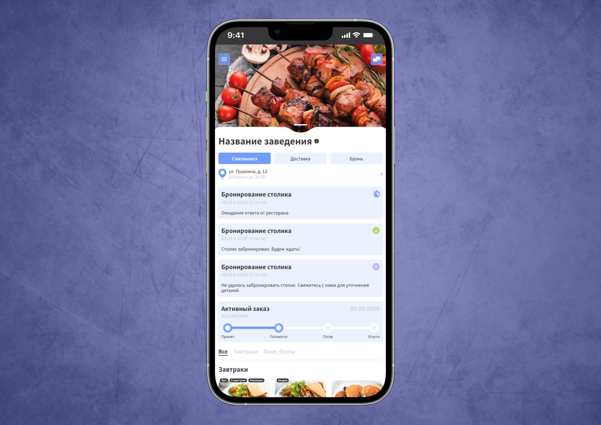

# 📱 Nomi Delivery — Mobile Food Delivery Interface

Nomi Delivery is a mobile-first food delivery application interface built to provide a fast and intuitive ordering experience across the city. The project involved developing a responsive, performance-optimized layout with a strong focus on usability and scalable frontend architecture. A key implementation is a modular multi-step interaction system that manages multiple contextual pop-ups with personalized content and can be easily reused and extended. Additionally, a real-time chat feature was seamlessly integrated into the interface, ensuring smooth communication without disrupting the user journey.

---

<h3>🖼 Preview</h3>

---

<h3>🎯 Project Goals</h3>

- ✅ Build a user-friendly and adaptive website with responsive design that reflects the company’s services
- ✨ Add personality and liveliness to the site through pure JavaScript animations
- ⚡ Ensure high loading speed and cross-browser compatibility (Google Chrome, Safari, Yandex Browser, Opera, Edge, Brave, etc.)
- 🛠 Develop clean, valid, and maintainable code using only standard web technologies to guarantee stability and performance

---

<h3>🧩 Development Features</h3>

- 📐 Semantic **HTML5** markup for well-structured and accessible architecture  
- 🎨 **CSS3 + SCSS (Sass)** for styling with modularity and reusability  
- 🏷️ **BEM methodology** for organized class naming and scalability  
- 📱 Responsive layout with **Flexbox** and **CSS Grid**  
- ⚙️ **JavaScript** for interactive elements and dynamic behavior  
- 🔄 **Gulp + Webpack** for task automation:  
  - SCSS compilation  
  - Minification  
  - Image optimization  
  - Hot-reload during development  

---

<h3>🛠️ Tech Stack</h3>

| Technology         | Purpose                   |
| ------------------ | ------------------------- |
| **HTML5**          | Structure & semantics     |
| **CSS3 / SCSS**    | Styling & maintainability |
| **BEM**            | Clean and scalable code   |
| **Flexbox & Grid** | Responsive design         |
| **JavaScript**     | Dynamic functionality     |
| **Gulp & Webpack** | Build automation          |

---

✨ The chosen **technology stack** ensures stable performance, ease of development, and long-term support.
